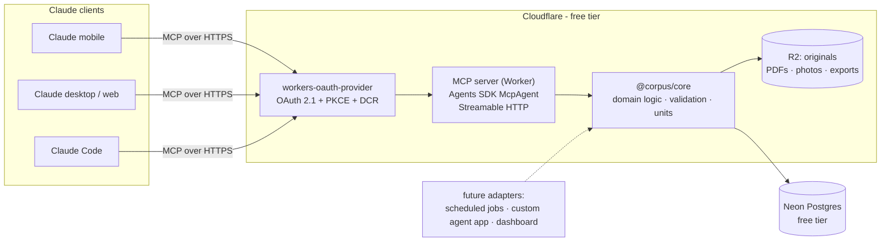

# Corpus — System Specification

**Status:** Draft v1 · 2026-07-01
**Owner:** Scott Schmalz

Corpus is a personal health & wellness tracking system. It stores exercise, nutrition, medication/supplement, lab/test, biometric, and goal data in one place, and exposes that data to AI agents so that daily interaction — both data entry and analysis — happens conversationally. The canonical interaction is asking questions like:

- *"What kind of workout should I do today?"* — considering recent training (muscle groups, volume), last night's sleep, HRV, and energy levels.
- *"Think up some items I can eat to finish off the day and meet my macros."* — considering today's logged meals against current targets.
- *"What foods should I be eating to drive down my cholesterol?"* — considering lab history, diet composition, and training.

---

## 1. Guiding principles & constraints

1. **TypeScript everywhere.**
2. **Cost ceiling: <$5/month**, ideally $0. Lean on free tiers; the design below lands at $0/mo.
3. **Agent-first interaction.** No UI in v1. The MCP server *is* the product surface; Claude (web/desktop/mobile) is the client. LLM inference rides the existing Claude subscription — no per-token API costs.
4. **The agent parses, the system validates.** LLMs handle the messy input (meal photos, lab PDFs, spoken workout recaps); Corpus provides precise, Zod-validated tools and owns data integrity, unit normalization, and canonical naming.
5. **Single user now, multi-user ready.** Every row is owned by a `user_id`; auth maps identities to users. Adding a second user (e.g., Scott's wife) is a data change, not a schema change.
6. **Keep originals.** Source documents (lab PDFs, DEXA reports, meal photos, exports) are retained in object storage and linked to the structured records extracted from them, so extractions are auditable and repeatable.
7. **Hexagonal core.** Domain logic + persistence live in a core library with no MCP or HTTP dependencies. The MCP server is the first adapter; a custom agent app, scheduled jobs, or a dashboard can be added later without rework.
8. **Fresh start + key baselines.** No full historical backfill. Import current baselines only: recent labs (Function Health, PCP), DexaFit/RMR/VO2 Max results, current med/supplement regimen, current goals. Schema accepts arbitrary historical dates if that changes.

## 2. Decision log

| # | Decision | Choice | Alternatives considered |
|---|----------|--------|------------------------|
| 1 | Agent surface | Remote MCP server used from Claude apps; architecture keeps a custom agent app possible later | Custom chat app (per-token cost), MCP-only forever |
| 2 | Web UI | None in v1 | Read-only dashboard, full app |
| 3 | History | Fresh start + baseline imports | Full backfill, fresh-only |
| 4 | Source documents | Keep originals in R2, linked to extracted records | Extract-and-discard |
| 5 | Nutrition granularity | Hybrid: item-level when inferable, meal totals otherwise | Always item-level, totals-only |
| 6 | Workout granularity | Modality-aware detail: per-set strength, distance/pace/HR runs, structured metcons | Session summaries |
| 7 | Meds/supplements | Regimen + exceptions (assume adherence, log deviations) | Per-dose logging, static list |
| 8 | Biometrics ingestion | Daily conversational check-in + **nightly automated Garmin pull via the unofficial API** (GitHub Actions job → worker ingest endpoint; revisited 2026-07-02 — check-in remains the always-available fallback) | Manual export imports (original choice; superseded — recurring friction); official Health API (individuals can't apply, program suspended); paid aggregators like Terra/Spike (B2B pricing, ≥$300/yr) |
| 8b | MacroFactor import | Dropped (2026-07-02) — conversational `log_meal` covers nutrition entry and Scott may stop using MacroFactor | CSV export parser |
| 9 | Hosting | Cloudflare Workers + Neon Postgres + R2 | Vercel, Fly.io, AWS |
| 10 | MCP auth | OAuth 2.1 (PKCE + Dynamic Client Registration) via `workers-oauth-provider` | Bearer token / secret URL |

## 3. Architecture



- **One deployable**: a Cloudflare Worker exposing the MCP server (Streamable HTTP transport) via the Cloudflare Agents SDK (`McpAgent`, backed by Durable Objects — free tier covers this).
- **`@corpus/core`** is a plain TypeScript package: entity types, Zod schemas, unit conversion, movement catalog logic, and a Drizzle-based repository layer. It has no knowledge of MCP or Workers APIs beyond the DB/R2 bindings passed into it.
- **Neon Postgres** over the `@neondatabase/serverless` driver (HTTP/WebSocket — works from Workers).
- **R2** holds original documents; Postgres holds a `documents` metadata row per object.

### Repository layout

```
corpus/
├── packages/
│   └── core/            # domain types, zod schemas, drizzle schema, repositories, unit conversion
├── apps/
│   └── mcp-server/      # Cloudflare Worker: McpAgent, OAuth, tool/resource/prompt definitions
├── docs/                # this spec, ADRs as decisions evolve
└── (npm workspaces, shared tsconfig/eslint)
```

## 4. Technology stack

| Concern | Choice | Notes |
|---------|--------|-------|
| Language | TypeScript (strict) | |
| Runtime | Cloudflare Workers | Free: 100k req/day, 10ms CPU/invocation — tools are I/O-bound, LLM does the heavy parsing, so this is ample |
| MCP framework | Cloudflare Agents SDK (`agents` pkg, `McpAgent`) + `@modelcontextprotocol/sdk` | Streamable HTTP; per-session Durable Object |
| Auth | `workers-oauth-provider` | Spec-compliant OAuth 2.1 server incl. PKCE + DCR (what Claude clients expect); upstream login via Google, email allowlist |
| Database | Neon Postgres (free: 0.5 GB, 100 CU-hrs/mo, scale-to-zero) | Row-level security keyed to `app.user_id` session setting |
| ORM/migrations | Drizzle ORM + drizzle-kit | Typed schema shared from `@corpus/core` |
| Validation | Zod | Tool input schemas double as MCP tool JSON schemas |
| Object storage | Cloudflare R2 (free: 10 GB) | Private bucket; presigned URLs for upload/review |
| Package manager | npm workspaces | Sufficient for a 2-package workspace; wrangler is package-manager-agnostic |
| CI/CD | GitHub Actions → `wrangler deploy` on main | Repo: github.com/whitebirchio/corpus |

**Estimated cost: $0/month.** Every component sits comfortably inside free tiers at personal-use volume (tens of tool calls/day, a few MB of new data/month). Optional: custom domain ~$10/yr (the free `*.workers.dev` subdomain works fine). If Workers free limits ever pinch, the paid tier is exactly the $5/mo budget.

### Known free-tier tradeoffs

- **Neon scale-to-zero** means the first query after idle pays a ~0.5–1s cold start. Acceptable for conversational use.
- **Neon 0.5 GB storage**: years of headroom at this data shape (rows are small; bulky originals go to R2).
- **Workers 10ms CPU**: fine for validate-and-write tools; bulk imports are chunked (§8.4).

## 5. Data model

Conventions:

- Every domain table has `id` (UUID v7), `user_id` (FK → `users`), `created_at`, `updated_at`. RLS policies filter on `user_id = current_setting('app.user_id')`.
- **Canonical units in storage**: kg for mass/load, meters for distance, seconds for duration, kcal for energy. Tools accept `{ value, unit }` pairs and **the server converts** — the LLM never does unit math. Display preference (imperial) lives on `users`.
- Timestamps stored UTC; each user has a `timezone` (America/…) used to derive the `local_date` that daily records key on.
- `source` columns discriminate provenance: `checkin | conversation | garmin_export | macrofactor_export | document_extraction | manual`.
- `source_ref` columns hold a stable identifier from the origin system when one exists (Garmin activity id, MacroFactor entry id, lab accession number). These are the backbone of import idempotency (§5.9).
- Narrow, well-known columns for whatever analysis will query often; `extras jsonb` escape hatch on ingestion tables for long-tail fields.

### 5.1 Identity

```
users            id, email (unique), display_name, timezone,
                 unit_preference (imperial|metric), created_at
```

OAuth identities map to `users` by allowlisted email. No roles/permissions in v1 — every user sees only their own rows (RLS).

### 5.2 Biometrics & body composition

```
daily_metrics    user_id, local_date (unique per user), source,
                 sleep_duration_s, sleep_score, sleep_quality_subjective (1-5),
                 sleep_deep_s, sleep_light_s, sleep_rem_s, sleep_awake_s,
                 hrv_ms, resting_hr, steps,
                 body_battery (day high), body_battery_low, stress_score,
                 respiration_avg, spo2_avg, active_kcal, bmr_kcal,
                 intensity_minutes_moderate, intensity_minutes_vigorous,
                 training_readiness (0-100), vo2max (watch estimate),
                 energy_subjective (1-5), soreness_notes, notes, extras jsonb

body_measurements user_id, measured_at, source, document_id?, fitness_test_id?,
                 weight_kg, body_fat_pct, lean_mass_kg, fat_mass_kg,
                 bone_mineral_content_kg, visceral_fat_kg, visceral_fat_rating,
                 android_gynoid_ratio, almi, ffmi,           -- kg/m^2 indices
                 bmd_total_gcm2, bmd_tscore, bmd_zscore,
                 body_score,                                  -- provider grade, e.g. "C+"
                 extras jsonb

body_composition_regions  id, measurement_id, region (arm|leg|trunk|head|ribs|
                 spine|pelvis|total|android|gynoid), side (left|right|both)?,
                 lean_mass_kg?, fat_mass_kg?, fat_pct?,
                 bmd_gcm2?, bmd_percentile?
```

- `daily_metrics` is fed by the ~30-second morning check-in (read off the Garmin watch/app) and later reconciled/backfilled by Garmin export imports (import overwrites check-in values where the export is authoritative, preserving subjective fields).
- `body_measurements` unifies scale weigh-ins and DEXA scans. A simple weigh-in populates only `weight_kg` (+ maybe `body_fat_pct`); a DEXA import fills the full headline set. Storing headline body comp here (not just in the test's jsonb) is what makes weight/body-fat/lean-mass trend *across* sources — scale readings and DEXA scans on one timeline.
- `body_composition_regions` holds the per-region, per-side detail a DEXA scan produces (the sample reports left/right arm/leg/trunk lean & fat mass plus regional bone density percentiles). Normalizing it — rather than burying it in jsonb — makes longitudinal questions answerable in SQL: limb asymmetry over time, regional BMD trajectory, visceral-fat trend. Only DEXA imports write these rows; it stays empty for scale weigh-ins. (Whole-body-only tracking works fine without this table, so it can land in Phase 2 alongside the first real DEXA import.)

### 5.3 Workouts

Hierarchy: **session → block → block_movement → set**. Blocks carry modality, so one session can mix a warmup, a strength block, and a metcon.

```
workout_sessions id, user_id, started_at, local_date, title, source, source_ref?,
                 duration_s, session_rpe (1-10), avg_hr, max_hr, calories,
                 notes, extras jsonb

workout_blocks   id, session_id, seq,
                 block_type (strength|run|metcon|interval|warmup|cooldown|mobility|other),
                 -- metcon structure:
                 scheme (amrap|emom|for_time|rounds_for_time|tabata|chipper|ladder|custom)?,
                 rounds_planned?, time_cap_s?, interval_s?,
                 -- metcon result:
                 result_time_s?, result_rounds?, result_reps?, rx (bool)?,
                 -- cardio (run/row/bike) detail:
                 distance_m?, duration_s?, avg_pace_s_per_km?, avg_hr?, max_hr?,
                 elevation_gain_m?, splits jsonb?,
                 rpe?, notes

movements        id, name (canonical), aliases text[],
                 category (squat|hinge|press|pull|carry|olympic|core|monostructural|plyo|other),
                 primary_muscles text[], secondary_muscles text[], equipment text[]
                 -- global catalog (not per-user), seeded; agent may propose additions

block_movements  id, block_id, movement_id, seq,
                 prescription text ("5x5 @ 185", "21-15-9"),
                 reps_per_round?, load_kg? (metcon load), distance_m_per_round?

strength_sets    id, block_movement_id, set_number, reps, load_kg,
                 rpe?, is_warmup, is_failure, notes
```

This supports all three modalities natively:

- **Strength**: block_type `strength`, one `block_movements` row per exercise, one `strength_sets` row per set (load, reps, RPE).
- **Running**: block_type `run` with distance/duration/pace/HR/splits on the block.
- **HIIT/CrossFit**: block_type `metcon` with `scheme`, planned rounds/time cap, per-movement rep schemes and loads, and the result (time or rounds+reps, rx flag).

The `movements` catalog with `primary_muscles` is what powers *"what muscle groups have been targeted recently?"* — a join away from any workout query.

### 5.4 Nutrition

```
nutrition_targets user_id, effective_date, calories, protein_g, carbs_g, fat_g,
                  fiber_g?, notes    -- effective-dated: MacroFactor adjusts targets over time

meals            id, user_id, eaten_at, local_date,
                 meal_type (breakfast|lunch|dinner|snack),
                 description, granularity (itemized|totals),
                 calories, protein_g, carbs_g, fat_g,   -- always populated (summed or direct)
                 photo_document_id?, source, source_ref?, notes

meal_items       id, meal_id, seq, name, quantity, unit_note ("1 cup", "6 oz"),
                 calories, protein_g, carbs_g, fat_g,
                 micros jsonb (fiber_g, sugar_g, sat_fat_g, sodium_mg,
                               cholesterol_mg, potassium_mg, ...),
                 estimate_confidence (high|medium|low)
```

Hybrid granularity per decision #5: when Scott describes a meal (or sends a photo), the agent itemizes into `meal_items` with estimated macros + key micros and the meal totals are computed; when he just reports MacroFactor numbers, a `totals`-granularity meal (or one catch-all daily entry) is written. Food-quality analysis (*"what's driving my cholesterol"*) uses whatever itemized data exists; macro adherence works either way.

### 5.5 Medications & supplements

```
regimen_items    id, user_id, name, type (medication|supplement),
                 dose_amount, dose_unit, schedule_text ("1x daily, morning, with food"),
                 schedule jsonb (times_per_day, timing[]),
                 purpose, prescriber?, started_on, ended_on?, notes

regimen_events   id, regimen_item_id, local_date,
                 event_type (skipped|extra_dose|dose_changed|paused|resumed), notes
```

Adherence is assumed; only exceptions are logged. Dose changes end the current row (`ended_on`) and open a new one, preserving history for correlation against labs and biometrics (*"HRV since starting X"*).

### 5.6 Documents, labs & fitness tests

```
documents        id, user_id, r2_key, filename, content_type, size_bytes, sha256,
                 kind (lab_report|dexa_report|fitness_test|meal_photo|export|screenshot|other),
                 uploaded_at, description, extraction_status (pending|extracted|verified|failed)

lab_panels       id, user_id, collected_on, reported_on?,
                 source (function_health|pcp|dexafit|other),
                 lab_name?,                 -- performing lab, e.g. "Quest"
                 ordering_provider?, accession_number?, fasting?,
                 document_id?, notes

lab_results      id, panel_id, sub_panel?,  -- e.g. "Lipid Panel", "CMP", "Urinalysis"
                 analyte (canonical, e.g. "ldl_cholesterol"),
                 raw_name (as printed), category (lipids|metabolic|cbc|hormones|thyroid|
                 vitamins_minerals|inflammation|cardio_advanced|urinalysis|
                 heavy_metals|autoimmune|other),
                 value_text (verbatim: "168", "<10", "NEGATIVE", "NONE SEEN"),
                 value_num numeric?,         -- parsed when numeric; null for qualitative
                 comparator (eq|lt|gt|le|ge, default eq),  -- "<10" -> lt, 10
                 unit?,
                 ref_low numeric?, ref_high numeric?,      -- when range is a plain interval
                 ref_text?,                  -- verbatim range: "<200", ">= 40", "See Note"
                 flag (normal|low|high|critical|abnormal)?,
                 method?, performing_lab?, note

fitness_tests    id, user_id, performed_on, test_type (vo2max|rmr|dexa|other),
                 provider?, document_id?,
                 primary_value numeric?, primary_unit?,   -- e.g. 47 ml/kg/min; 2144 kcal/day
                 results jsonb,                            -- typed per test_type (see below)
                 notes
```

- `lab_results` is deliberately EAV-shaped — lab panels vary wildly, and *"show my LDL trend"* is `WHERE analyte = 'ldl_cholesterol' ORDER BY collected_on`. A canonical analyte dictionary (canonical name + preferred unit + category + typical range) lives in `@corpus/core`; the agent maps printed names to canonical ones during extraction. The Function sample alone spans ~90 analytes across 11 categories, so the dictionary is substantial and seeded up front.
- **Values are not always numbers** — this is the key lesson from the real Function report, and why `value numeric` was wrong. Results come as plain numbers (`168`), censored/detection-limit values with a comparator (`<10`, `<0.2`), and pure qualitative strings (`NEGATIVE`, `YELLOW`, `NONE SEEN`). So every result stores `value_text` verbatim (never lossy), plus a parsed `value_num` + `comparator` when it's quantitative — trends chart off `value_num`, audits fall back to `value_text`.
- **Reference ranges are just as heterogeneous** (`<200`, `>= 40`, `250-425`, `See Note`, sex/age/time-of-day-specific). Keep numeric `ref_low`/`ref_high` when the printed range is a plain interval (enables auto-flagging and chart bands); always keep `ref_text` verbatim for everything else.
- `fitness_tests` is the single event log for "I went and got measured." `primary_value` holds the headline number for quick trending (VO2 max, measured RMR); the rest lives in a `results` jsonb whose **shape is documented and Zod-typed per `test_type`** in `@corpus/core`, so it's predictable rather than a free-for-all:
  - `vo2max` → `{ biological_age, max_hr, vt1_bpm, vt2_bpm, training_zones[], redline_ratio, lean_vo2max, leg_lean_vo2max, percentiles{} }`. The **HR thresholds and training zones here feed the "what workout today?" recommendation** and are surfaced via `corpus://profile` / `get_daily_summary`.
  - `rmr` → `{ rmr_kcal, rer, fuel_fat_pct, fuel_carb_pct, resting_hr, predicted_rmr, classification, tdee_by_activity{} }`.
  - `dexa` → soft/context fields (`body_score`, targets, peer percentiles); the structured body-comp numbers fan out to `body_measurements` (+ `body_composition_regions`) rather than living only here.
- **DEXA import fans out** to four writes: `documents` (the PDF) + `fitness_tests` (`test_type=dexa`) + `body_measurements` (headline, `fitness_test_id` back-link) + N `body_composition_regions` (per-region detail). VO2 Max and RMR imports write `documents` + `fitness_tests` only.
- **Import provenance & dedup:** a single visit can emit several PDFs on one date (the DexaFit sample = RMR + VO2 Max + DEXA, all 2026-04-14 at "DexaFit Nashua"), and providers re-export identical files (two of the six samples are byte-adjacent duplicates). `documents.sha256` catches exact re-uploads; the agent links same-date/same-provider tests as one visit and confirms before creating a second panel/test for a date that already has one.

### 5.7 Goals & insights

```
goals            id, user_id, title, domain (fitness|nutrition|body_comp|labs|lifestyle),
                 description, priority (int, lower = more important),
                 target jsonb ({ metric, target_value, unit, direction })?,
                 target_date?, status (active|paused|achieved|abandoned),
                 status_changed_at, notes

insights         id, user_id, created_at, title, body, tags text[],
                 status (active|archived), source (agent|user)
```

`insights` gives the agent durable memory across conversations: confirmed conclusions and working hypotheses (*"LDL elevated on 2026-05 Function panel; prioritizing fiber + sat-fat reduction; re-test in Q4"*) persist and are surfaced in the daily summary, instead of being rediscovered every chat.

### 5.8 Subjective observations

```
observations     id, user_id, observed_at, local_date,
                 kind (energy|mood|soreness|symptom|note),
                 value_num? (1-5), body_area?, text
```

Cheap to log conversationally, valuable for correlations ("afternoon energy crashes vs. lunch composition").

### 5.9 Idempotency & deduplication

A first-class requirement: the same lab panel, day, workout, or export imported twice must **not** create duplicate records. Corpus never blindly inserts — every write is dedup-aware. Three tiers, applied by record type:

**1. Content hash (opaque files).** `documents` carries `sha256` of the file bytes with a unique index on `(user_id, sha256)`. Re-uploading the same PDF reuses the existing `document_id` instead of storing a second copy. This is what catches the two byte-identical DexaFit exports in the sample set.

**2. Natural-key upsert (structured records with a stable identity).** Each such table has a unique constraint on its business key, and writes use `INSERT … ON CONFLICT DO UPDATE` — so a repeat becomes an update, not a new row. Where the origin system supplies a stable id, `source_ref` is that key and gives the strongest guarantee (`(user_id, source, source_ref)` unique). Keys per table:

| Record | Natural key | Notes |
|--------|-------------|-------|
| `daily_metrics` | `(user_id, local_date)` | Already unique. Re-logging a day updates it; a later Garmin export **merges** (measured fields win, subjective check-in fields preserved) rather than duplicating. |
| `lab_panels` | `(user_id, source, accession_number)`; fallback `(user_id, source, collected_on, lab_name)` | Function reports carry an accession number (`WC992483A`) — a perfect idempotency key. |
| `lab_results` | `(panel_id, analyte)` | Re-import updates values / adds newly-present analytes; a changed value on an existing analyte is surfaced as a conflict, not silently overwritten. |
| `fitness_tests` | `(user_id, test_type, performed_on, provider)` | Re-importing the 2026-04-14 DEXA matches the existing row. |
| `workout_sessions` | `(user_id, source, source_ref)` when a Garmin activity id exists; else soft-match (tier 3) | Garmin exports carry per-activity ids. |
| `meals` | `(user_id, source, source_ref)` for MacroFactor entries; else soft-match (tier 3) | Totals-style daily imports upsert on the source id. |
| `nutrition_targets` | `(user_id, effective_date)` | |
| `regimen_items` | `(user_id, name, started_on)` | The started/ended-dated model already prevents dupes. |
| `body_measurements` | `(user_id, measured_at, source)`, or `fitness_test_id` for DEXA-derived rows | Fans out deterministically from a test, so it dedups with the test. |

**3. Agent-mediated soft dedup (records with no reliable natural key).** Conversationally-logged meals and workouts have no stable id — you *can* legitimately eat two identical snacks or do the same session twice. Here the write tool doesn't guess: before inserting, it checks for near-matches (same `local_date` + `meal_type`/modality, overlapping time, similar macros/movements) and, if it finds one, returns the candidate to the agent so it can ask you *"log this as a new entry, or did you mean to correct the one from this morning?"* The database stops silent duplication; the agent resolves genuine ambiguity out loud rather than the system deciding wrong.

**Import contract.** Every importer (§8.4) is therefore safely re-runnable: re-importing an overlapping Garmin/MacroFactor window updates the rows it already has, inserts only what's new, and reports a `{created, updated, skipped}` summary the agent relays back to you. Re-running an import is always safe.

## 6. MCP surface

Design philosophy: a **small set of validated write tools** (the agent can't corrupt data — Zod schemas, server-side unit conversion, movement/analyte canonicalization) plus a **read-only SQL tool** for open-ended analysis (an LLM with SQL against a well-named schema outperforms any fixed set of report endpoints), plus a few **convenience reads** to keep common queries cheap and reliable.

### 6.1 Write tools

| Tool | Purpose |
|------|---------|
| `log_workout` | Full session payload (blocks/movements/sets per §5.3). Resolves movement names against the catalog (fuzzy + aliases); unknown movements are created with agent-proposed muscle mappings, flagged for review. |
| `log_meal` | Itemized or totals-granularity meal; server computes totals from items. |
| `log_daily_checkin` | Upserts `daily_metrics` for a date (sleep, HRV, RHR, steps, subjective energy) + optional weigh-in → `body_measurements`. |
| `log_observation` | Subjective one-offs (energy, mood, soreness, symptoms). |
| `upsert_regimen_item` / `end_regimen_item` / `log_regimen_event` | Manage the med/supplement regimen and exceptions. |
| `record_lab_panel` | Panel + array of results (canonical analytes); optionally links a `document_id`. |
| `record_fitness_test` | VO2 Max / RMR / DEXA results (`results` jsonb typed per `test_type`); DEXA fans out to `body_measurements` + `body_composition_regions`. |
| `upsert_goal` / `update_goal_status` | Manage goals and priorities. |
| `save_insight` / `archive_insight` | Durable agent conclusions. |
| `create_document_upload` | Returns `document_id` + presigned R2 PUT URL for storing an original (§8.3). |
| *(not an MCP tool)* `/garmin/ingest` | Worker HTTP endpoint (shared-secret auth) receiving the nightly Garmin sync payload; mapping/reconciliation in `@corpus/core` (§8.4). Replaced the planned `import_export_file` tool when imports went automated. |

All writes return the created record (with computed fields) so the agent can confirm what was stored back to the user. All log tools accept a `date`/`occurred_at` override for late entry ("log yesterday's workout"). Every write is dedup-aware per §5.9 — natural-key upsert where identity is stable, agent-confirmed soft-match where it isn't — so no tool ever silently creates a duplicate.

### 6.2 Read tools

| Tool | Purpose |
|------|---------|
| `get_daily_summary` | The morning-briefing payload for a date: last night's sleep/HRV/RHR, today's macros vs. targets, recent training load by muscle group, active goals by priority, current regimen, active insights. One call primes any daily conversation. |
| `query_data` | **Read-only SQL** (SELECT-only Postgres role, RLS-scoped to the authenticated user, row limit + timeout). The open-ended analysis workhorse. |
| `get_recent_workouts` / `get_lab_history(analyte)` / `get_goals` / `get_regimen` | Convenience wrappers for the highest-frequency lookups — cheaper and less error-prone than generated SQL. |

### 6.3 Resources & prompts

- **Resource `corpus://schema`** — annotated schema reference (tables, columns, semantics, canonical units) so the model writes correct SQL without trial and error. *Implemented.*
- **Resource `corpus://analytes`** — canonical analyte dictionary (snake_case names, categories, preferred units) for lab mapping. *Implemented* (the analyte dictionary was split out of `corpus://schema`).
- **Resource `corpus://profile`** — user preferences, timezone, active goals digest. *Implemented* (`apps/mcp-server/src/profile.ts`).
- **Prompts** — reusable, versioned workflows: `morning_checkin`, `log_workout_conversation`, `plan_todays_workout`, `finish_my_macros`, `import_lab_report`, `weekly_review`. These encode the interaction patterns so every chat doesn't reinvent them. *Implemented* (`apps/mcp-server/src/prompts.ts`); each expands to a single user-turn message that drives the workflow through the real tools.

## 7. Auth & security

- **OAuth 2.1 authorization server** via `workers-oauth-provider` on the same Worker: PKCE (S256) and Dynamic Client Registration, which is what Claude's custom connectors expect across web/desktop/mobile. Verified: custom connectors are available on all Claude plans, connecting from Anthropic's cloud across all clients.
- **Upstream identity**: Google sign-in (Scott's existing account; his wife's later). The callback maps the verified email against an **allowlist** in config → `users` row. Anyone else is rejected at login; DCR being open therefore admits no data access.
- **Authorization**: every DB session sets `app.user_id`; **Postgres RLS** on all domain tables enforces per-user isolation — including through the raw `query_data` tool, which additionally runs as a SELECT-only role with statement timeout and row limits.
- **R2 bucket is private**; access only via short-lived presigned URLs issued to the authenticated user.
- Transport is HTTPS end-to-end; secrets live in Worker secrets (never in the repo); health data never appears in logs (log tool names + record ids, not payloads).
- This is sensitive health data: no third-party analytics, no telemetry, no public endpoints beyond the OAuth flow and MCP endpoint.

## 8. Key flows

### 8.1 Morning check-in (~30 seconds)
1. Scott (phone): "Morning check-in: slept 7h10 with a sleep score of 82, HRV 58, resting HR 47, felt pretty rested. Weight 178.2."
2. Agent calls `log_daily_checkin` (server converts 178.2 lb → kg, writes `daily_metrics` + `body_measurements`).
3. Agent calls `get_daily_summary` and responds with anything noteworthy (HRV trend, macro targets, what training is due).

### 8.2 Workout logging & recommendation
- *"What should I do today?"* → `get_daily_summary` (+ `query_data` for muscle-group volume over the past 7–10 days) → recommendation weighing recovery signals against goal priorities.
- Post-workout recap in natural language (any modality) → agent structures it → `log_workout` → confirms stored session, flags PRs (via `query_data` against history).

### 8.3 Lab import (occasional)
1. Scott attaches the Function Health PDF in Claude and asks to import it.
2. Agent reads the PDF **in-context** (the LLM is the parser), maps analytes to canonical names, and presents the structured panel for confirmation.
3. On confirmation: `create_document_upload` → Scott stores the original via the presigned URL (one `curl`/browser upload from desktop; ergonomics improve in Phase 3) → `record_lab_panel` with `document_id`.
4. Agent compares against prior panels and updates `insights` if warranted.

### 8.4 Garmin sync (nightly, automated — rescoped 2026-07-02)
1. A **GitHub Actions scheduled job** (`apps/garmin-sync`, real Python — the Workers sandbox can't run `garminconnect`'s socket-based HTTP) authenticates against Garmin's unofficial API using a cached session token blob stored in Worker KV, fetched/updated via `/garmin/tokens`. Garmin credentials never leave Scott's machine: a one-time local `bootstrap` run (MFA-capable) seeds the tokens; nightly runs refresh them.
2. The job pulls a trailing 7-day window and POSTs the raw JSON to `/garmin/ingest` (shared-secret auth). Wellness spans `get_stats` (steps, RHR, body battery high/low, avg stress, active/BMR kcal, intensity minutes, waking respiration), the full sleep DTO (duration, score, deep/light/REM/awake stages, overnight SpO2/respiration), `get_hrv_data`, plus the device-dependent `get_training_readiness` and `get_max_metrics` (VO2 max / fitness age); activity summaries additionally carry training effect/load and running dynamics. **All mapping and reconciliation live in `@corpus/core`** (`import/garmin.ts`) — one write path, fully covered by PGlite tests. Backfill is re-running the pull: idempotent merges mean a widened schema repopulates the trailing window on the next (or a manual `--days N`) run.
3. Reconciliation per §5.9: wellness merges into `daily_metrics` (measured wins, subjective preserved); activities key on `source_ref = garmin:<activityId>` — already-imported are skipped, same-day conversational sessions are **enriched in place** (HR/duration/calories filled, ref stamped) rather than duplicated, unmatched cardio creates a `garmin_export` session, and unmatched strength is deferred (per-set detail comes from conversational logging; the trailing window self-heals once logged).
4. Failures are loud: the job exits non-zero → GitHub emails. The conversational check-in remains a permanent fallback, so Garmin breakage never blocks data entry.
5. MacroFactor import: dropped (decision 8b).

## 9. Multi-user path (later, cheap)

Add wife's email to the allowlist → she signs in via Google → `users` row created → she adds the connector in her own Claude account. RLS keeps data fully separate. Nothing else changes. (Shared/household views, if ever wanted, become explicit cross-user grants — out of scope until real.)

## 10. Build phases

| Phase | Scope | Exit criterion |
|-------|-------|----------------|
| **0 — Scaffold** | npm workspaces, `@corpus/core` + `apps/mcp-server`, Drizzle + Neon, wrangler config, CI deploy, hello-world MCP tool reachable from Claude | Connector added in Claude; test tool responds |
| **1 — Core loop** | Full schema + migrations + RLS; OAuth (Google upstream, allowlist); write tools: checkin, workout (all 3 modalities), meal, observation, regimen, goals; reads: `get_daily_summary`, `query_data`, schema resource; movement catalog seeded | A full real day (check-in, meals, workout, "what workout today?") runs end-to-end from the phone |
| **2 — Baselines & documents** | R2 + `documents` + presigned upload; `record_lab_panel` / `record_fitness_test` + analyte dictionary; import actual baselines: Function Health panel, DexaFit/RMR/VO2 Max, current regimen, goals | Cholesterol question answerable against real lab data |
| **3 — Imports & rhythm** | Automated nightly Garmin sync (unofficial API via GitHub Actions → `/garmin/ingest`, §8.4) with reconciliation; ~~MacroFactor CSV parser~~ (dropped, decision 8b); MCP prompts (`morning_checkin`, `weekly_review`, …); upload-ergonomics pass | Garmin biometrics land nightly with zero manual steps; weekly review works |
| **4 — Later / optional** | Scheduled Workers (cron) for proactive briefings (needs a push channel — e.g., email), custom agent app on `@corpus/core`, read-only dashboard, second user | — |

## 11. Risks & open questions

1. **Estimation accuracy** — agent macro estimates from photos/descriptions are ±20%+. Mitigations: `estimate_confidence` on items, prefer MacroFactor numbers when available, treat trends over absolutes.
2. **Upload ergonomics from mobile** — presigned-URL upload is clunky on a phone. Phase 3 revisits (tiny authenticated upload page or MCP file passthrough if/when Claude clients support it). Lab imports are infrequent and desktop-friendly, so v1 accepts this.
3. **Free-tier drift** — pricing verified 2026-07 (sources in docs/ADRs); a Workers-paid fallback ($5/mo) exists and equals the budget ceiling.
4. **Unit errors** — the classic silent corruption. Mitigated by design: unit-tagged tool inputs, server-side conversion only, canonical metric storage, echo-back confirmation after every write.
5. **Schema evolution** — early logging will surface missing fields fast. `extras jsonb` absorbs surprises; Drizzle migrations keep changes cheap. Expect schema churn in weeks 1–4.
6. **Claude connector behavior changes** — MCP + connectors are evolving quickly; transport (Streamable HTTP) and auth (OAuth 2.1 + DCR) follow the current spec, which is the most future-proof position available.
7. **Wife onboarding needs her own Claude account** for connector use — acceptable; revisit if it becomes a blocker.
8. **Unofficial Garmin API breakage** — Garmin can change the protocol or invalidate sessions without notice (it has before). Mitigations: failures are loud (GitHub Actions email), recovery is a one-command local re-bootstrap, the trailing-window pull backfills missed nights, and the conversational check-in keeps working regardless. Terms-of-service gray area accepted knowingly for personal single-account use.

## Appendix A — Sample report inventory

Reference for building the analyte dictionary (Phase 2) and importers (Phase 3), drawn from six real reports Scott provided on 2026-07-01. Only the Function report has an embedded text layer; the DexaFit PDFs are image-only and must be parsed by the LLM from rendered pages (a deterministic parser is not viable for them).

**Function Health — blood & urine (Quest via Health Gorilla, collected 2026-06-19, 16 pp).** ~90 analytes across: lipids (total/HDL/LDL-Martin-Hopkins/triglycerides/non-HDL, ratios), advanced cardio (ApoB, Lp(a), lipoprotein fractionation by ion mobility, OmegaCheck), CMP (glucose, BUN, creatinine, eGFR, electrolytes, liver enzymes, protein/albumin), CBC w/ differential, hormones (total+free testosterone by LC/MS, estradiol, FSH, LH, prolactin, DHEA-S, SHBG, cortisol), thyroid (TSH, free T4, free T3, TPO Ab, Tg Ab), vitamins/minerals (25-OH vitamin D, zinc, RBC magnesium, ferritin/iron/TIBC/% sat), metabolic risk (fasting insulin, HbA1c, uric acid, homocysteine, leptin, MMA), inflammation/autoimmune (hs-CRP, ANA IFA, rheumatoid factor), heavy metals (blood mercury, venous lead), and a full urinalysis. Illustrates every value shape the schema must hold: plain numbers, censored values (`<10`, `<0.2`), qualitative strings (`NEGATIVE`, `YELLOW`, `NONE SEEN`), H/L flags (`28 L`, `100 H`, `241 L`), and reference ranges as intervals, one-sided bounds, and free text.

**DexaFit RMR (3 pp, measured 2026-04-14).** Measured RMR 2144 kcal/day (classified "FAST"; predicted 1706), RER 0.77 with fuel split (77% fat / 23% carb), resting HR 61 bpm, and a TDEE-by-activity-level table (Sedentary 2573 → Extremely Active 4074, each with fat-loss and lean-gain calorie bands). → `fitness_tests` (`test_type=rmr`).

**DexaFit VO2 Max (5 pp; the "Operator" file is a duplicate).** VO2 max 47 ml/kg/min (~79th pct, "Excellent"), biological age 33, max HR 176, VT1 111, VT2 168, four training zones (HR % and kcal/hr bands), and advanced metrics — Redline Ratio 94%, Lean VO2 Max 67, Leg Lean VO2 Max 192 — each with peer percentiles and a target. → `fitness_tests` (`test_type=vo2max`); HR zones feed workout recommendations.

**DexaFit Body Composition / DEXA (7 pp; `DXAReport.pdf` is a duplicate).** Body Score C+; total mass 171.1 lb, lean 120.5 lb, fat 45.3 lb (26.5%); visceral fat 2.84 lb; A/G ratio 1.84 (android 36.8% / gynoid 20.0%); ALMI 9.2 kg/m², FFMI 20.2 kg/m²; per-region left/right lean & fat mass for arms/trunk/legs; bone — BMC 5.3 lb, whole-body T-score and Z-score −0.10, regional BMD (total/trunk/head/arms/legs/ribs/spine/pelvis) in g/cm² with percentiles. Nearly every metric carries a peer percentile and a target. → `fitness_tests` (`test_type=dexa`) + `body_measurements` + `body_composition_regions`.

Two of the six files are exact-content duplicates (Operator≡VO2 Max, DXAReport≡Body Composition), and three DexaFit reports share one visit date — validating the sha256 dedup and same-visit linking described in §5.6.
